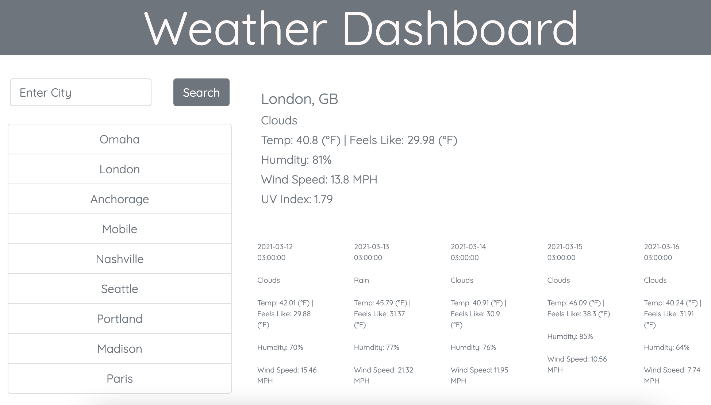

# Weather Dashboard

The weather dashboard has a very simplistic, symmetrical design.
Input on lefthand side for query and results delivered on the righthand side, centered under a large header.

## User Story

```
AS A USER I want to register a current weather report for specific location(s),
WHEN I enter a city name in the search bar a single-day and five-day forecast displays,
THEN the entered city is stored in a generated list for callback,
WHEN I click on stored city names the appropriate forecast data returns to screen
```

## Description

Weather info provided includes location, status (i.e. 'clear,' 'cloudy,' etc.), dates for five day forecast,
temperature and "feels like" comparison, humidity, wind speed and UV Index included in current day weather card.

Entries are filed into a generated list beneath the search input.

The current day function runs on a combination of current day and UV Index URL fetches. Information is extracted from
returned data coordinates and registered appropriately for the convenience of the users' discretion.

The five day forecast is an independent URL fetch that which also registers filtered information accordingly to mirror the
current day weather card.

City search entries are rendered between a few functions (search button, render storage and develop storage), and generated via
JavaScript to accrue a list of prior location searches for the user to toggle and compare and contrast.

## Final Product

The final product operates as shown below:


